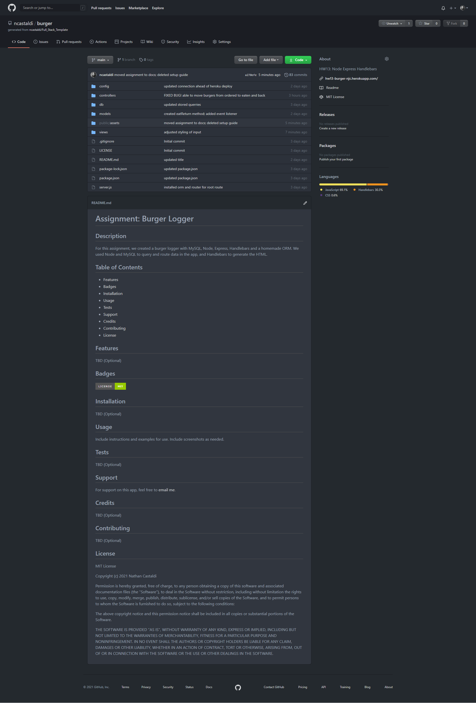
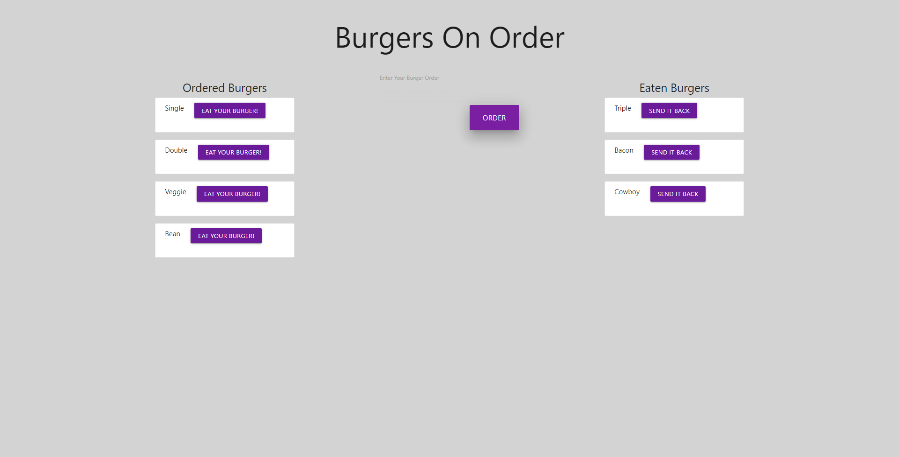

# Assignment: Burger Logger

## Description

For this assignment, we created a burger logger with MySQL, Node, Express, Handlebars and a homemade ORM. We used Node and MySQL to query and route data in the app, and Handlebars to generate the HTML.

## Table of Contents

- [Badges](#badges)
- [Usage](#usage)
- [Support](#support)
- [License](#license)

## Badges

## Usage

1. Enter your burger order into the input field and click "Order".
2. Click on an "Ordered Burger" to have it served to you.
3. Click on a "Served Burger" to send it back to the kitchen.

- GitHub Repository: [https://github.com/ncastaldi/burger](https://github.com/ncastaldi/burger)

- Live Site: [https://hw13-burger-njc.herokuapp.com/](https://hw13-burger-njc.herokuapp.com/)

## Support

For support on this app, feel free to [email me](mailto://nathan@castaldi.dev).

## License

MIT License

Copyright (c) 2021 Nathan Castaldi

Permission is hereby granted, free of charge, to any person obtaining a copy
of this software and associated documentation files (the "Software"), to deal
in the Software without restriction, including without limitation the rights
to use, copy, modify, merge, publish, distribute, sublicense, and/or sell
copies of the Software, and to permit persons to whom the Software is
furnished to do so, subject to the following conditions:

The above copyright notice and this permission notice shall be included in all
copies or substantial portions of the Software.

THE SOFTWARE IS PROVIDED "AS IS", WITHOUT WARRANTY OF ANY KIND, EXPRESS OR
IMPLIED, INCLUDING BUT NOT LIMITED TO THE WARRANTIES OF MERCHANTABILITY,
FITNESS FOR A PARTICULAR PURPOSE AND NONINFRINGEMENT. IN NO EVENT SHALL THE
AUTHORS OR COPYRIGHT HOLDERS BE LIABLE FOR ANY CLAIM, DAMAGES OR OTHER
LIABILITY, WHETHER IN AN ACTION OF CONTRACT, TORT OR OTHERWISE, ARISING FROM,
OUT OF OR IN CONNECTION WITH THE SOFTWARE OR THE USE OR OTHER DEALINGS IN THE
SOFTWARE.
